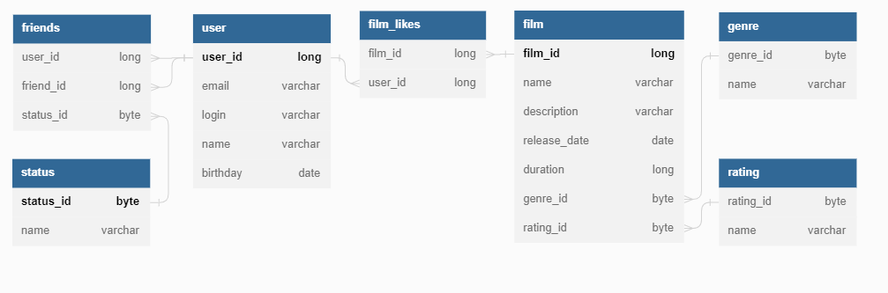

--Примеры запросов к базе данных:
-- получение всех пользователей
SELECT *
FROM user;

-- получение пользователя по его id
SELECT *
FROM user
WHERE user_id = 1;

-- получение друзей пользователя по его id
SELECT fr.friend_id AS user_friends
FROM user AS u
INNER JOIN friends AS fr ON u.user_id = fr.user_id
WHERE u.user_id = 1;

-- получение общих друзей двух пользователей по их id
SELECT fr.friend_id
FROM user AS u
INNER JOIN friends AS fr ON u.user_id = fr.user_id
WHERE u.user_id = 2
      AND fr.friend_id IN (SELECT fr.friend_id AS user_friends
                           FROM user AS u
                           INNER JOIN friends AS fr ON u.user_id = fr.user_id
                           WHERE u.user_id = 1);

-- получение всех фильмов
SELECT f.film_id,
       f.name,
       f.description,
       f.release_date,
       f.duration,
       g.name AS genre_name,
       r.name AS rating_name
FROM film AS f
LEFT OUTER JOIN genre AS g ON f.genre_id = g.genre_id
LEFT OUTER JOIN rating AS r ON f.rating_id = r.rating_id

-- получение фильма по его id
SELECT f.film_id,
       f.name,
       f.description,
       f.release_date,
       f.duration,
       g.name AS genre_name,
       r.name AS rating_name
FROM film
LEFT OUTER JOIN genre AS g ON f.genre_id = g.genre_id
LEFT OUTER JOIN rating AS r ON f.rating_id = r.rating_id
WHERE film_id = 7

-- получение 10 популярных фильмов (с наибольшим кол-вом лайков от пользователей)
SELECT f.film_id,
       f.name,
       f.description,
       f.release_date,
       f.duration,
       g.name AS genre_name,
       r.name AS rating_name
FROM film AS f
LEFT OUTER JOIN film_likes AS fl ON f.film_id = fl.film_id
LEFT OUTER JOIN genre AS g ON f.genre_id = g.genre_id
LEFT OUTER JOIN rating AS r ON f.rating_id = r.rating_id
GROUP BY f.film_id
ORDER BY COUNT(fl.user_id) DESC
LIMIT 10
